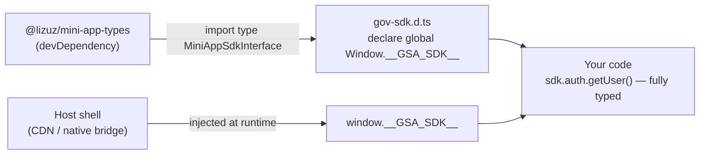

# Getting Started

The Sewa Mini App SDK is **injected by the host shell** at runtime via `window.__GSA_SDK__`. You do not `npm install` the SDK itself. Instead, your mini app depends on the shared type package for development, and the host provides the live SDK instance when your app is mounted inside the container.

You can see the full working example in [`test-mini-app/`](/).

---

## Prerequisites

The SDK runtime is host-provided — your app installs only the type package for compile-time safety:

```bash
pnpm add -D @lizuz/mini-app-types
```

Your mini app is built as an **ES library** that exports a `mount` / `unmount` lifecycle. The host loads your bundle and calls `mount(container, runtime)` when the user opens the mini app.



`mini-app-sdk` itself re-exports every shared type from the same `@lizuz/mini-app-types` package as its single source — see `src/types/sdk.types.ts` in the SDK. Host, SDK, and mini app all agree on `PlatformMessage`, `MiniAppSdkInterface`, `SdkEventMap`, etc., from one place. Adding the dev dependency gives you the full `sdk.*` surface, `PlatformUser`, `AppearanceState`, `Device*` results, and `SdkEventMap` without any runtime bundle cost.

---

## 1. Type Declarations (`gov-sdk.d.ts`)

Declare the globals that the host injects so TypeScript knows about them. This is the file from [`test-mini-app/src/gov-sdk.d.ts`](/):

```typescript
// src/gov-sdk.d.ts
import type {
  MiniAppSdkInterface,
  PlatformUser,
  DeviceBiometricOptions,
  AppearanceState,
} from "@lizuz/mini-app-types";

declare global {
  type MiniAppSdk = MiniAppSdkInterface;
  type SdkPlatformUser = PlatformUser;

  interface Window {
    __GSA_SDK__?: MiniAppSdk; // set by host before mount()
  }
}
```

`MiniAppSdkInterface` covers every namespace (`sdk.auth`, `sdk.device`, `sdk.http`, `sdk.appearance`, `sdk.gicChat`, `sdk.debug`, `sdk.getMetrics`, …), `request`/`requestSafe`/`batch`, `on`/`once`/`events`/`emit`, `use`/`usePlugin`/`registerModule`, and the `SdkEventMap` event catalog. Types for hooks follow directly:

```typescript
// src/hooks/usePlatformSDK.ts — typed via the global
import { useContext } from "react";
import { SDKContext } from "../context/SDKContext";

export function usePlatformSDK(): SDKContextValue & { sdk: MiniAppSdk } {
  const ctx = useContext(SDKContext);
  if (!ctx.sdk) throw new Error("usePlatformSDK must be used within PlatformSDKProvider");
  return { ...ctx, sdk: ctx.sdk };
}
```

No `import { MiniAppSdk } from "@lizuz/mini-app-sdk"` at runtime — the host provides the instance. Types come from `@lizuz/mini-app-types` and are erased at build.

---

## 2. Entry Point (`main.tsx`)

Export a `mount` function — the host calls it with a DOM container and an optional `initialPath`:

```typescript
// src/main.tsx
import { createRoot } from "react-dom/client";
import type { Root } from "react-dom/client";
import App from "./App.tsx";

export function mount(container: HTMLElement, runtime?: { initialPath?: string }) {
  const root: Root = createRoot(container);
  root.render(<App initialPath={runtime?.initialPath} />);
  return { unmount() { root.unmount(); } };
}
```

No direct SDK import — the provider reads `window.__GSA_SDK__` at runtime.

---

## 3. Vite Build (`vite.config.ts`)

Build as a library so the host can load your bundle as a module:

```typescript
// vite.config.ts
import react from "@vitejs/plugin-react";
import tailwindcss from "@tailwindcss/vite";
import { defineConfig } from "vite";

export default defineConfig({
  plugins: [react(), tailwindcss()],
  build: {
    target: "chrome89",
    outDir: "dist",
    lib: {
      entry: "./src/main.tsx",
      name: "RevenueMiniApp",
      formats: ["es"],
      fileName: () => "[name][hash].js",
    },
    rollupOptions: {
      output: { format: "es", chunkFileNames: "assets/[name]-[hash].js" },
    },
  },
});
```

See the complete config in [`test-mini-app/vite.config.ts`](/).

---

## 4. Teardown

The SDK instance itself does not need manual `destroy()` in normal host-injected usage — the `PlatformSDKProvider` cleans up via `AbortController` when the component unmounts. If you hold a direct reference outside React, call `sdk.destroy()` on unmount.
