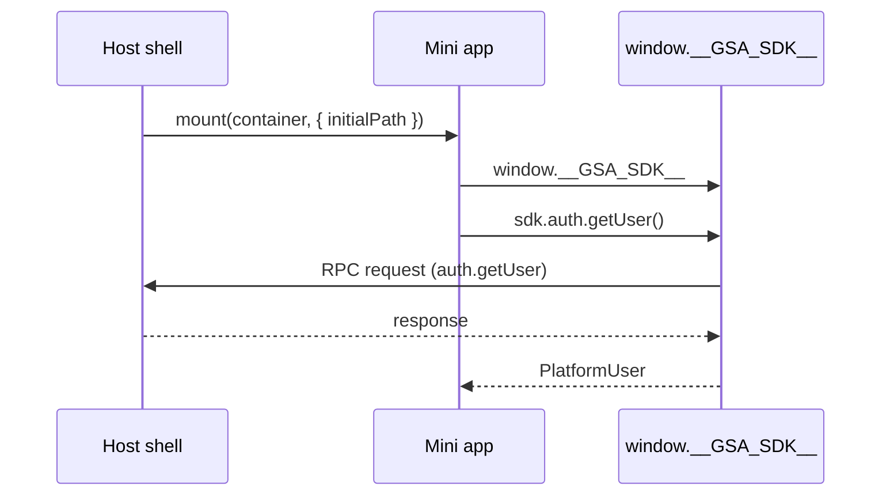

import {TypesPackageName, InstallCommandTabs} from '@site/src/components/TypesPackage';

# Platform Overview

The Sewa Platform hosts vendor mini apps inside the Sewa Citizen shell (web and Flutter). The host loads each mini app as an ES module, injects the SDK at `window.__GSA_SDK__`, and mediates all privileged operations over an RPC bridge.

## Runtime Model

- **Mini app bundle**: Vite `lib` build exporting `mount(container, runtime)` - see [`Getting Started`](/docs/getting-started) and [`test-mini-app/`](https://github.com/anomalyco/sewa-platform/tree/main/test-mini-app).
- **SDK injection**: The host sets `window.__GSA_SDK__` before calling `mount`. No `npm install` of the SDK.
- **Types**: install the type package with your preferred manager:

<InstallCommandTabs />

## Capability Negotiation

On first use the SDK performs a handshake (`handshake.connect`) carrying `miniAppId`, `sdkVersion`, `protocolVersion`, and the requested capability list. The host replies with the granted set. Ungranted capabilities throw `CAPABILITY_NOT_SUPPORTED`.

See [Protocol & Handshake](/docs/sdk/protocol) for the wire format.

## Transport

`DefaultTransport` uses `postMessage` + `CustomEvent (gov-platform-event)` with origin pinning. Alternatives (`WebSocketTransport`, `BroadcastTransport`, `MessagePortTransport`, `SsrTransport`) are documented in [Transport](/docs/sdk/transport).

## Next Steps

- [Getting Started](/docs/getting-started) - scaffold a mini app
- [SDK Reference](/docs/sdk/core) - all namespaces
- [React Guide](/docs/integration/react) - reference implementation
