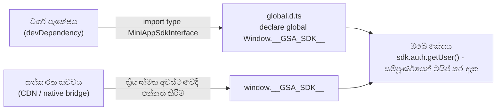

import {TypesPackageName, InstallCommandBlock, ImportCodeBlock} from '@site/src/components/TypesPackage';

# ආරම්භ කිරීම

සේවා කුඩා යෙදුම් SDK එක සත්කාරක කවචය මගින් ක්‍රියාත්මක අවස්ථාවේදී `window.__GSA_SDK__` හරහා **එන්නත් කරනු ලැබේ**. ඔබ SDK එක `npm install` නොකරයි. ඒ වෙනුවට, ඔබේ කුඩා යෙදුම සංවර්ධනය සඳහා හවුල් වර්ග පැකේජය මත රඳා පවතී, සහ සත්කාරකය ඔබේ යෙදුම කන්ටේනරය තුළ සවි කර ඇති විට සජීවී SDK අවස්ථාව සපයයි.

ඔබට සම්පූර්ණ ක්‍රියාකාරී උදාහරණය [`test-mini-app/`](/si/docs/getting-started) හි දැකිය හැකිය.

---

## පූර්ව අවශ්‍යතා

SDK ක්‍රියාත්මක කිරීම සත්කාරක-සපයනු ලැබේ - ඔබේ යෙදුම සම්පාදන-කාල ආරක්ෂාව සඳහා වර්ග පැකේජය පමණක් ස්ථාපනය කරයි:

<InstallCommandBlock />

ඔබේ කුඩා යෙදුම **ES පුස්තකාලයක්** ලෙස ගොඩනගා ඇති අතර එය `mount` / `unmount` ජීවන චක්‍රය අපනයනය කරයි. සත්කාරකය ඔබේ බණ්ඩලය පූරණය කර පරිශීලකයා කුඩා යෙදුම විවෘත කරන විට `mount(container, runtime)` අමතයි.

`mini-app-sdk` විසින් එම <TypesPackageName /> පැකේජයෙන්ම එහි තනි මූලාශ්‍රය ලෙස සියලු හවුල් වර්ග නැවත අපනයනය කරයි.

---

## 1. වර්ග ප්‍රකාශන (`global.d.ts`)

සත්කාරකය එන්නත් කරන ගෝලීයයන් TypeScript දැන ගැනීම සඳහා ප්‍රකාශ කරන්න. මෙය [`test-mini-app/src/global.d.ts`](/si/docs/getting-started) වෙතින් ගත් ගොනුවයි:

<ImportCodeBlock />

## 2. ඇතුල්වීමේ ස්ථානය (`main.tsx`)

`mount` ශ්‍රිතයක් අපනයනය කරන්න - පරිශීලකයා කුඩා යෙදුම විවෘත කරන විට සත්කාරකය එය DOM කන්ටේනරයක් සහ විකල්ප `initialPath` සමඟ අමතයි. `window.__GSA_SDK__` ක්‍රියාත්මක අවස්ථාවේදී කියවනු ලැබේ.

## 3. Vite ගොඩනැගීම (`vite.config.ts`)

සත්කාරකයට ඔබේ බණ්ඩලය මොඩියුලයක් ලෙස පූරණය කළ හැකි වන පරිදි පුස්තකාලයක් ලෙස ගොඩනඟන්න. සම්පූර්ණ වින්‍යාසය [`test-mini-app/vite.config.ts`](/si/docs/getting-started) හි බලන්න.

## 4. ඉවත් කිරීම

SDK අවස්ථාවට සාමාන්‍ය සත්කාරක-එන්නත් කළ භාවිතයේදී අතින් `destroy()` අවශ්‍ය නොවේ - `PlatformSDKProvider` සංරචකය ඉවත් කරන විට `AbortController` හරහා පිරිසිදු කරයි.
