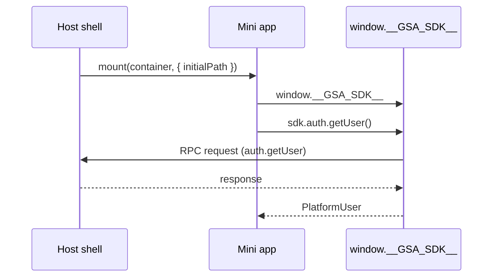

import {TypesPackageName} from '@site/src/components/TypesPackage';

# වේදිකා දළ විශ්ලේෂණය

සේවා වේදිකාව සැපයුම්කරුගේ කුඩා යෙදුම් (mini apps) සේවා පුරවැසි කවචය (web සහ Flutter) තුළ සත්කාරකත්වය දරයි. සත්කාරකය (host) එක් එක් කුඩා යෙදුම ES මොඩියුලයක් ලෙස පූරණය කරයි, SDK එක `window.__GSA_SDK__` හිදී එන්නත් කරයි, සහ සියලු වරප්‍රසාද ලත් මෙහෙයුම් RPC පාලම හරහා මැදිහත් කරයි.

## ක්‍රියාත්මක කිරීමේ ආකෘතිය

- **කුඩා යෙදුම් බණ්ඩලය**: Vite `lib` ගොඩනැගීම `mount(container, runtime)` අපනයනය කරයි - [`ආරම්භ කිරීම`](/docs/getting-started) සහ [`test-mini-app/`](https://github.com/anomalyco/sewa-platform/tree/main/test-mini-app) බලන්න.
- **SDK එන්නත් කිරීම**: සත්කාරකය `mount` ඇමතීමට පෙර `window.__GSA_SDK__` සකසයි. SDK හි `npm install` අවශ්‍ය නොවේ.
- **වර්ග**: <code>pnpm add -D <TypesPackageName /></code>.

## හැකියාවන් සාකච්ඡා කිරීම

පළමු භාවිතයේදී SDK `handshake.connect` හරහා `miniAppId`, `sdkVersion`, `protocolVersion` සහ ඉල්ලූ හැකියාවන් ලැයිස්තුව රැගෙන යයි. සත්කාරකය ලබා දුන් කට්ටලය සමඟ පිළිතුරු දෙයි. ලබා නොදුන් හැකියාවන් `CAPABILITY_NOT_SUPPORTED` විසි කරයි.

රැහැන් ආකෘතිය සඳහා [ප්‍රොටෝකෝලය සහ හෑන්ඩ්ෂේක්](/docs/sdk/protocol) බලන්න.

## ප්‍රවාහනය

`DefaultTransport` `postMessage` + `CustomEvent (gov-platform-event)` මූලාරම්භය පින් කිරීම සමඟ භාවිතා කරයි. විකල්ප (`WebSocketTransport`, `BroadcastTransport`, `MessagePortTransport`, `SsrTransport`) [ප්‍රවාහනය](/docs/sdk/transport) හි ලේඛනගත කර ඇත.

## ඊළඟ පියවර

- [ආරම්භ කිරීම](/docs/getting-started) - කුඩා යෙදුමක් සකසන්න
- [SDK විමර්ශනය](/docs/sdk/core) - සියලු නාම අවකාශ
- [React මාර්ගෝපදේශය](/docs/integration/react) - විමර්ශන ක්‍රියාත්මක කිරීම
