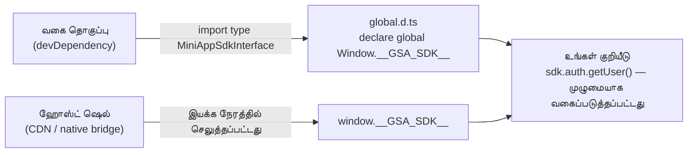

import {TypesPackageName, InstallCommandBlock, ImportCodeBlock} from '@site/src/components/TypesPackage';

# தொடங்குதல்

சேவா மினி ஆப் SDK ஹோஸ்ட் ஷெல் மூலம் இயக்க நேரத்தில் `window.__GSA_SDK__` வழியாக **செலுத்தப்படுகிறது**. நீங்கள் SDK ஐ `npm install` செய்ய வேண்டாம். அதற்கு பதிலாக, உங்கள் மினி ஆப் மேம்பாட்டிற்காக பகிரப்பட்ட வகை தொகுப்பை சார்ந்துள்ளது, மற்றும் ஹோஸ்ட் உங்கள் ஆப் கொள்கலனுக்குள் ஏற்றப்படும் போது நேரடி SDK நிகழ்வை வழங்குகிறது.

முழு செயல்பாட்டு உதாரணத்தை [`test-mini-app/`](/ta/docs/getting-started) இல் காணலாம்.

---

## முன்தேவைகள்

SDK இயக்க நேரம் ஹோஸ்ட்-வழங்கப்படுகிறது — உங்கள் ஆப் தொகுப்பு-நேர பாதுகாப்பிற்காக வகை தொகுப்பை மட்டுமே நிறுவுகிறது:

<InstallCommandBlock />

உங்கள் மினி ஆப் **ES நூலகமாக** கட்டமைக்கப்பட்டுள்ளது, இது `mount` / `unmount` வாழ்க்கைச் சுழற்சியை ஏற்றுமதி செய்கிறது. பயனர் மினி ஆப்பைத் திறக்கும்போது ஹோஸ்ட் உங்கள் தொகுப்பை ஏற்றி `mount(container, runtime)` ஐ அழைக்கிறது.

`mini-app-sdk` அதே <TypesPackageName /> தொகுப்பிலிருந்து அதன் ஒற்றை மூலமாக அனைத்து பகிரப்பட்ட வகைகளையும் மீண்டும் ஏற்றுமதி செய்கிறது.

---

## 1. வகை அறிவிப்புகள் (`global.d.ts`)

ஹோஸ்ட் செலுத்தும் உலகளாவியவற்றை TypeScript அறியும் வகையில் அறிவிக்கவும். இது [`test-mini-app/src/global.d.ts`](/ta/docs/getting-started) இலிருந்து கோப்பு:

<ImportCodeBlock />

## 2. நுழைவு புள்ளி (`main.tsx`)

`mount` செயல்பாட்டை ஏற்றுமதி செய்யுங்கள் — பயனர் மினி ஆப்பைத் திறக்கும்போது ஹோஸ்ட் அதை DOM கொள்கலன் மற்றும் விருப்ப `initialPath` உடன் அழைக்கிறது.

## 3. Vite கட்டமைப்பு (`vite.config.ts`)

ஹோஸ்ட் உங்கள் தொகுப்பை தொகுதியாக ஏற்றக்கூடிய வகையில் நூலகமாக கட்டமைக்கவும். முழு உள்ளமைவை [`test-mini-app/vite.config.ts`](/ta/docs/getting-started) இல் பார்க்கவும்.

## 4. அகற்றுதல்

SDK நிகழ்வுக்கு சாதாரண ஹோஸ்ட்-செலுத்தப்பட்ட பயன்பாட்டில் கைமுறை `destroy()` தேவையில்லை — `PlatformSDKProvider` கூறு அகற்றப்படும்போது `AbortController` மூலம் சுத்தம் செய்கிறது.
