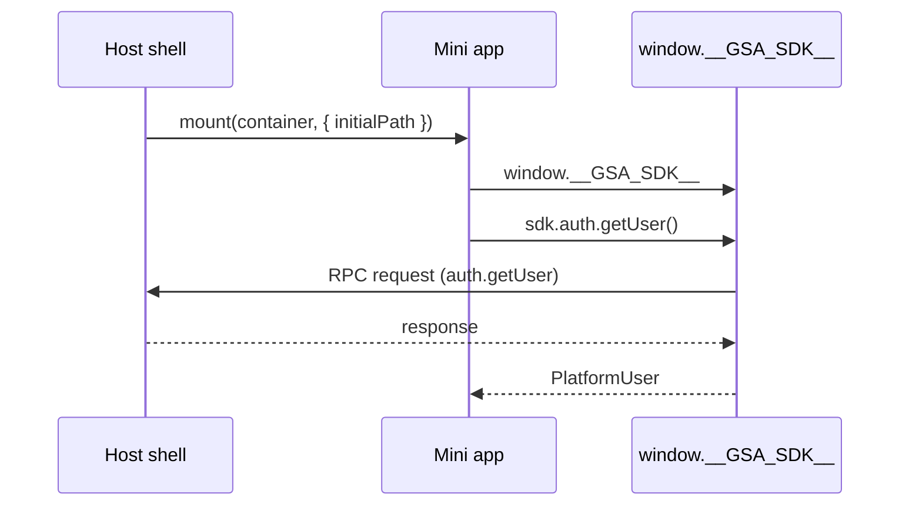

import {TypesPackageName} from '@site/src/components/TypesPackage';

# தள மேலோட்டம்

சேவா தளம் விற்பனையாளர் மினி ஆப்ஸ்களை சேவா குடிமகன் ஷெல் (web மற்றும் Flutter) உள்ளே ஹோஸ்ட் செய்கிறது. ஹோஸ்ட் ஒவ்வொரு மினி ஆப்பையும் ES தொகுதியாக ஏற்றுகிறது, SDK ஐ `window.__GSA_SDK__` இல் செலுத்துகிறது, மற்றும் அனைத்து சலுகை பெற்ற செயல்பாடுகளையும் RPC பாலம் மூலம் மத்தியஸ்தம் செய்கிறது.

## இயக்க மாதிரி

- **மினி ஆப் தொகுப்பு**: Vite `lib` கட்டமைப்பு `mount(container, runtime)` ஏற்றுமதி செய்கிறது - [`தொடங்குதல்`](/docs/getting-started) மற்றும் [`test-mini-app/`](https://github.com/anomalyco/sewa-platform/tree/main/test-mini-app) பார்க்கவும்.
- **SDK செலுத்துதல்**: ஹோஸ்ட் `mount` ஐ அழைப்பதற்கு முன் `window.__GSA_SDK__` ஐ அமைக்கிறது. SDK இன் `npm install` தேவையில்லை.
- **வகைகள்**: <code>pnpm add -D <TypesPackageName /></code>.

## திறன் பேச்சுவார்த்தை

முதல் பயன்பாட்டில் SDK `handshake.connect` மூலம் `miniAppId`, `sdkVersion`, `protocolVersion` மற்றும் கோரப்பட்ட திறன் பட்டியலை கொண்டு செல்கிறது. ஹோஸ்ட் வழங்கப்பட்ட தொகுப்புடன் பதிலளிக்கிறது. வழங்கப்படாத திறன்கள் `CAPABILITY_NOT_SUPPORTED` ஐ வீசுகின்றன.

வயர் வடிவத்திற்கு [நெறிமுறை & ஹேண்ட்ஷேக்](/docs/sdk/protocol) பார்க்கவும்.

## போக்குவரத்து

`DefaultTransport` `postMessage` + `CustomEvent (gov-platform-event)` மூல சரிபார்ப்புடன் பயன்படுத்துகிறது. மாற்றுகள் (`WebSocketTransport`, `BroadcastTransport`, `MessagePortTransport`, `SsrTransport`) [போக்குவரத்து](/docs/sdk/transport) இல் ஆவணப்படுத்தப்பட்டுள்ளன.

## அடுத்த படிகள்

- [தொடங்குதல்](/docs/getting-started) - மினி ஆப்பை உருவாக்கவும்
- [SDK குறிப்பு](/docs/sdk/core) - அனைத்து பெயர்வெளிகள்
- [React வழிகாட்டி](/docs/integration/react) - குறிப்பு செயல்படுத்தல்
